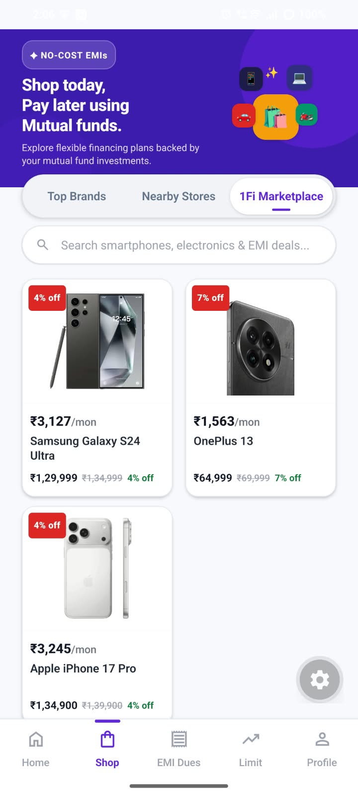
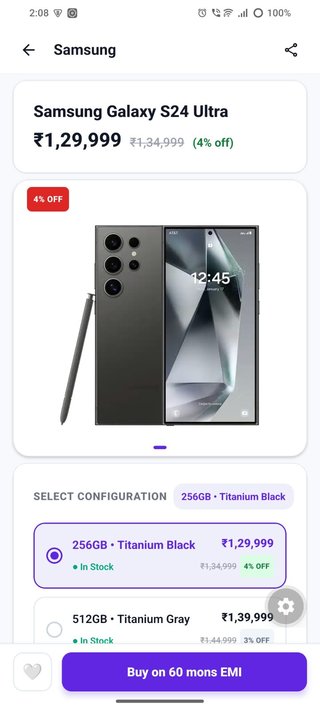
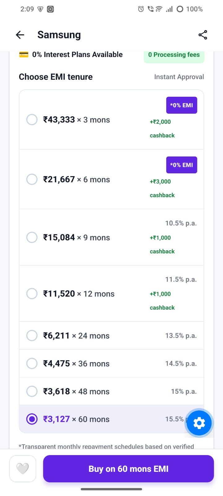
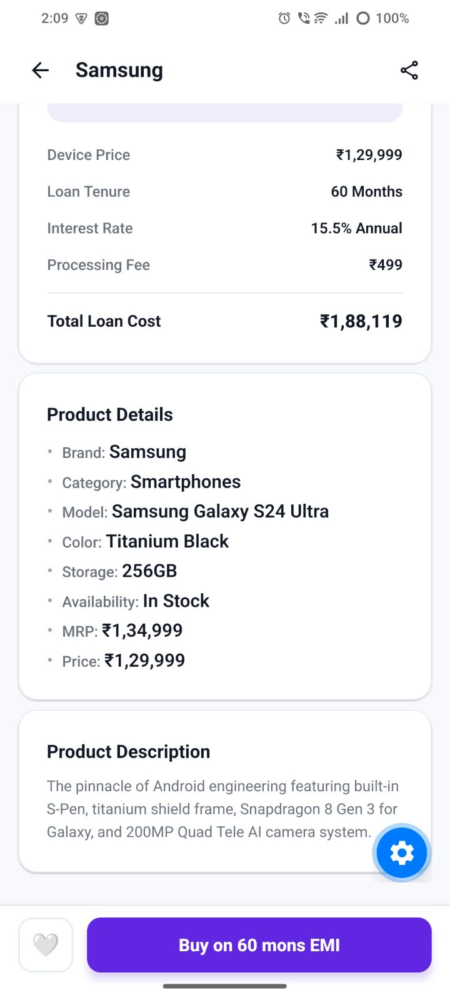
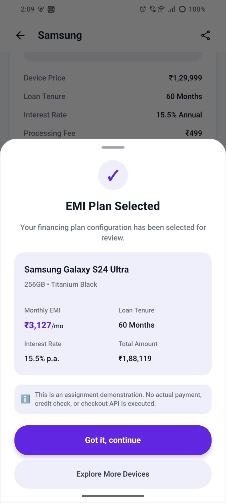

# 1Fi Marketplace — Mobile App

A high-performance, mobile-first e-commerce marketplace built with **Expo React Native**, **TypeScript**, and **Expo Router**. Designed with 1Fi's signature branding to deliver a zero-cost EMI shopping experience backed by mutual fund investments.

[](https://expo.dev/)
[](https://reactnative.dev/)
[](https://www.typescriptlang.org/)
[](https://emistore.onrender.com/api)

---

## 📱 App Showcase

<div align="center">
  <table>
    <tr>
      <td align="center" width="20%">
        
        <br />
        <b>1. Shop & Hero Banner</b>
      </td>
      <td align="center" width="20%">
        
        <br />
        <b>2. Product Catalog</b>
      </td>
      <td align="center" width="20%">
        
        <br />
        <b>3. Variant Selection</b>
      </td>
      <td align="center" width="20%">
        
        <br />
        <b>4. EMI Plan Selector</b>
      </td>
      <td align="center" width="20%">
        
        <br />
        <b>5. Financing Summary</b>
      </td>
    </tr>
  </table>
</div>

---

## 🌐 Live Backend & API Endpoints

The application is completely API-driven and connects to the deployed live production backend:

- **Base API URL**: [`https://emistore.onrender.com/api`](https://emistore.onrender.com/api)
- **Backend GitHub Repository**: [`https://github.com/RiteshDev99/emistore/tree/main/backend`](https://github.com/RiteshDev99/emistore/tree/main/backend)

### Available Endpoints

| Method | Endpoint | Description |
| :--- | :--- | :--- |
| `GET` | `/api/products` | Fetches the complete catalog of products with variants and EMI plans |
| `GET` | `/api/products/slug/:slug` | Fetches full product details, specifications, variants, and tenures by slug |

---

## ✨ Key Features

### 1. 1Fi Shop Mobile Experience
- **Compact Hero Banner**: Highlighting *"Shop today, Pay later using Mutual funds"* with no-cost EMI incentives.
- **Segmented Category Control**: Balanced 3-tab selector (`Top Brands`, `Nearby Stores`, `1Fi Marketplace`) with zero label clipping on mobile viewports.
- **Capsule Search Bar**: Contextual search placeholder aligned with active tabs.
- **5-Tab Bottom Navigation**: Fixed bottom bar (`Home`, `Shop` [active], `EMI Dues`, `Limit`, `Profile`) with safe-area insets.

### 2. Live 2-Column Marketplace Catalog
- **100% Dynamic Data**: All products, pricing, starting EMIs, and discounts are fetched in real-time from the backend.
- **Prominent Monthly EMI**: Automatically calculates and displays starting monthly repayments (`₹X,XXX/mon`).
- **Clean Card Architecture**: Edge-to-edge product viewports with single-line discount badges and truncated typography.

### 3. Dynamic Product Detail Page (`/products/[slug]`)
- **Variant Selector**: Switch between storage and color configurations with instant price, MRP, and stock updates.
- **Synchronized EMI Selector**: Changing variants automatically recalculates and resets available EMI plans.
- **Tenure Options**: Radio-based plan cards displaying monthly payments, tenures (3–60 months), interest rates, and cashback perks.
- **Itemized Financing Breakdown**: Comprehensive summary displaying device price, loan tenure, interest rate, processing fees, and total loan cost.
- **Structured Specifications & Description**: Clean bulleted technical specs and full product description.
- **Sticky Bottom CTA**: Sticky `🤍 Wishlist` + `Buy on [X] mons EMI` button opening an interactive confirmation modal.

### 4. Production-Ready Quality
- **Light Theme Enforced**: Strict light palette (`#F8F9FD` background, `#FFFFFF` cards, `#6226E3` 1Fi purple accent) with no dark mode switching.
- **Zero Hardcoded Data**: No mock data or hardcoded prices/products in UI components.
- **Polished Skeletons**: Pure visual layout placeholders during API loading with no developer text or debug spinners.

---

## 🏗️ Architecture & Data Flow

```
┌────────────────────────────────────────────────────────┐
│             Deployed Backend (Render)                  │
│       https://emistore.onrender.com/api                │
└───────────────────────────┬────────────────────────────┘
                            │ (REST API Fetch)
                            ▼
┌────────────────────────────────────────────────────────┐
│            Product Service Layer                       │
│           (src/services/productService.ts)             │
└───────────────────────────┬────────────────────────────┘
                            │ (Data Normalization)
                            ▼
┌────────────────────────────────────────────────────────┐
│           Deterministic Domain Utilities               │
│             (src/utils/productUtils.ts)                │
│  - formatCurrency()     - getStartingEMI()             │
│  - getDefaultEmiPlan()  - getDiscountPercentage()      │
└───────────────────────────┬────────────────────────────┘
                            │ (Synchronized React State)
                            ▼
┌────────────────────────────────────────────────────────┐
│           Expo React Native UI Components              │
│  - MarketplaceProductCard  - VariantSelector           │
│  - EmiPlanSelector         - SelectedEmiSummary        │
│  - ProductDetailImage      - PlanConfirmationModal     │
└────────────────────────────────────────────────────────┘
```

---

## 📁 Project Directory Structure

```bash
onefi-marketplace/
├── assets/
│   └── images/              # Mobile app showcase screenshots (img1 - img5)
├── src/
│   ├── app/
│   │   ├── _layout.tsx      # Root Stack navigation & Light ThemeProvider
│   │   ├── index.tsx        # 1Fi Shop home screen (Hero, Tabs, Catalog, Bottom Nav)
│   │   ├── explore.tsx      # Explore / Profile screen
│   │   └── products/
│   │       └── [slug].tsx   # Dynamic Product Detail route
│   ├── components/
│   │   ├── marketplace/     # PDP components (VariantSelector, EmiPlanSelector, etc.)
│   │   ├── shop/            # Shop screen components (Hero, Tabs, ProductCard, Grid)
│   │   └── ui/              # Reusable base UI primitives
│   ├── constants/
│   │   └── theme.ts         # Design tokens, color palette, and spacing constants
│   ├── hooks/
│   │   ├── use-theme.ts     # Light theme hook
│   │   └── use-color-scheme.ts
│   ├── services/
│   │   └── productService.ts # Live API client & fetch layer
│   ├── types/
│   │   ├── product.ts       # Product, Variant, and EMIPlan TypeScript interfaces
│   │   └── shop.ts          # Category tab types
│   └── utils/
│       └── productUtils.ts  # Currency, EMI, and discount calculation utilities
├── app.json                 # Expo application configuration
├── package.json             # Dependencies & scripts
└── tsconfig.json            # TypeScript configuration
```

---

## 🚀 Getting Started

### Prerequisites
- **Node.js**: `v18.x` or higher
- **npm** or **yarn**
- **Expo Go** app on your physical mobile device, or an iOS Simulator / Android Emulator

### Installation

1. **Clone the repository**:
   ```bash
   git clone https://github.com/RiteshDev99/onefi-marketplace.git
   cd onefi-marketplace
   ```

2. **Install dependencies**:
   ```bash
   npm install
   ```

3. **Start the Expo development server**:
   ```bash
   npx expo start
   ```

4. **Run on your device / simulator**:
   - Scan the terminal QR code with the **Expo Go** app (Android) or **Camera** app (iOS).
   - Press `a` for Android Emulator.
   - Press `i` for iOS Simulator.
   - Press `w` for Web preview.

### Type Checking

Verify strict TypeScript compilation:
```bash
npx tsc --noEmit
```

---

## 🛠️ Tech Stack & Dependencies

- **Framework**: [Expo](https://expo.dev/) (SDK 57)
- **Core Library**: [React Native](https://reactnative.dev/) 0.86.3 (React 19)
- **Routing**: [Expo Router](https://docs.expo.dev/router/introduction/) (File-based navigation)
- **Language**: [TypeScript](https://www.typescriptlang.org/)
- **Image Handling**: [expo-image](https://docs.expo.dev/versions/latest/sdk/image/)
- **Icons**: [expo-symbols](https://docs.expo.dev/versions/latest/sdk/symbols/)
- **Safe Area**: [react-native-safe-area-context](https://github.com/th3rdwave/react-native-safe-area-context)
- **Animations**: [react-native-reanimated](https://docs.swmansion.com/react-native-reanimated/)

---

## 📄 License

This project is licensed under the [MIT License](LICENSE).
